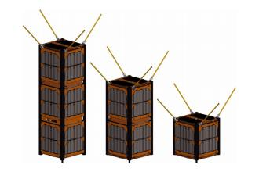
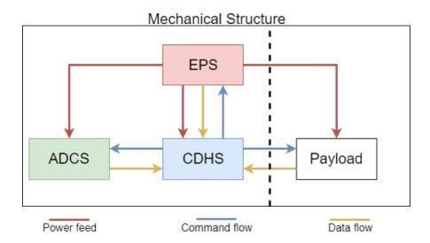
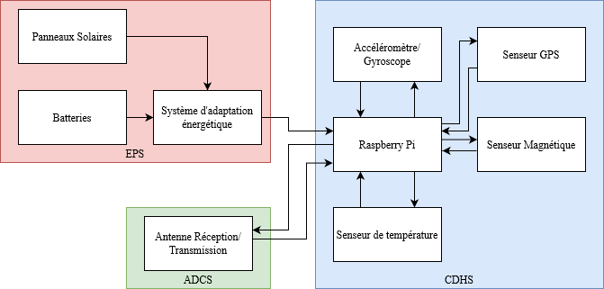

# Nanosatellite pédagogique PINISAT
## Justification du problème
Les nanosatellites se différencient des satellites classiques par leur taille et leur poids. Pour donner un ordre d’idée, le poids d’un satellite classique varie entre 300kg  et des  valeurs  bien  plus  élevées[1], alors qu’un  nanosatellite (comme le PINISAT) pèse entre 1et 10 kg.  De même, à cause de son poids, un satellite classique est bien plus cher qu’un nanosatellite, ce qui fait de ce dernier une option bien plus intéressante à exploiter dans le cas où le budget est limité. Malgré le fait qu’un nanosatellite coûte moins cher, sa mise en orbite reste assez coûteuse, de l’ordre de 40 000euros. Ce prix est négociable en fonction des attentes.  Le  CNES  propose  une  plateforme  pédagogique  pour  la  création  de  nanosatellites  à  prix  réduits,  dans  le  but d’apporter une solution à ce problème: le INISAT. Toutefois, bien que ce projet propose une solution moins chère pour la conception de nanosatellites, le but étant leur envoi dans l’espace, le prix reste alors inaccessible aux écoles qui souhaitent former des étudiants sur le sujet. Ce qui nous mène à notre projet, le PINISAT. Le PINISAT devrait donc répondre au besoin des écoles, celui d’avoir accès à des outils permettant la mise en place d’un nanosatellite sans avoir à dépenser de grandes sommes d’argent.
## État de l'art
### Cubesat
Un  CubeSat  correspond  à  l’implantation  standard  d’un  nanosatellite.  Ilexiste  trois  dimensions  différentes  du CubeSatdéfinies par ce standard-là :3Ude dimensions10x10x30 cm et de poids 3 kg, 2U de dimensions 10x10x20 cm et de poids 2kgetenfin,1Ude dimension 10x10x10 cm et de poids 1 kg. Ces différentesdimensions existent àcause des implantations variéesqui nécessitentd’un espace supplémentaire dans certains cas. Un exemple decestrois dimensions différentes est illustré par la figure ci-dessous:

Un CubeSatest constitué de cinq blocs différents: le sous-système mécanique, le système d’énergie électrique, le sous-système de détermination et de contrôle d’attitude, le sous-système de commande et de traitement des donnéeset la charge. 

Le sous-système mécanique(Mechanical Subsystem) fait référence à la structuredu satellite, celle quiluipermetde lutter contre lesconditions extrêmes de l’espace et de pouvoir s’attacher/se détacher de l’engin spatialquand il est mis  en  orbite. Le  système d’énergie électrique(EPS) est  chargé  de  fournirl’énergie électrique à tous les sous-composants  du  nanosatellite.  Ce systèmedoit  respecter  des  contraintes  depuissance  électriquedufait que  son énergieprovient entièrement des  rayons  solaires. Le  sous-système  de  détermination  et de contrôle de l’attitude(ADCS) correspond au cerveau de l’opération électronique du nanosatellite.Pour  notre  application,  ce  système fonctionnera partiellement. En effet, un système de processusdes données captées par les senseurs sera mis en place, cependant, aucun contrôle ne sera fait.Ensuite, le sous-systèmede commande et de traitement des données(CDHS) s’occupe d’installer la communication entre le satellite et un poste de communication terrestreet d’interpréter les données  permettant  de  répondre  à  une  commande  donnée.  Enfin,  la  chargeest  une  interface supplémentairequi permet de rajouter des fonctionnalités modulaires telles que la présence d’une caméra.

## Bibliographie
|               |               |       |
| ------------- |:-------------:| -----:|
|[1]| O. a. D. D. Quiros-Jimenez, «Development of a flight software framework for student CubeSat missions,» Revista Tecnología en Marcha, 12 2019.|
|[2]| E. D. Kaplan et C. Hegarty, Understanding GPS/GNSS: Principles and Applications: GNSS Technology and Applications Series, Third Edition éd., Artech House Publishers, 2017.|
|[3]| Garmin, «What is WAAS?,» 2021. [En ligne]. Available: https://www8.garmin.com/aboutGPS/waas.html.|
|[4]| ESEP et G. Quinsac, «Les cubesats,» 2021. [En ligne]. Available: http://sesp.esep.pro/fr/pages_nanosats/impression.html.|
|[5]| Sparkfun, «Gyroscope,» 2021. [En ligne]. Available: https://learn.sparkfun.com/tutorials/gyroscope?_ga=2.114580482.425130178.1613553094-1828180784.1613323896.|
|[6]| Wikipedia, «Magnéto-coupleur,» 2021. [En ligne]. Available: https://fr.wikipedia.org/wiki/Magn%C3%A9to-coupleur.|
|[7]| Raspberry Pi, «Raspberry Pi Documentation,» 2021. [En ligne]. Available: https://www.raspberrypi.org/documentation/hardware/raspberrypi/power/README.md.|
|[8]| Sparkfun, «Serial Communication,» 2021. [En ligne]. Available: https://learn.sparkfun.com/tutorials/serial-communication.|
|[9]| M. Khata, A. Ben Moumen, L. Eddarkaoui, A. Ly, A. Nal, P. Santos et W. Taibi, «Rapport Nanosatellite; SCAO 2 : Système de Commande d’Attitude et d’Orbite,» 2014.|
|[10]| J. Smith, «All about circuits,» 2016. [En ligne]. Available: https://www.allaboutcircuits.com/projects/build-a-solar-battery-charger-for-ni-mh-batteries/.|
|[11]| Y. Zheng, Space Microsystems and Micro/nano Satellites Butterworth-Heinemann, 2018.|
|[12]| D. Battu, «Systèmes de communications par satellite,» Réseaux Télécommunications, 2018.|
|[13]| D. Jost, «Fierce Electronics,» 2019. [En ligne]. Available: https://www.fierceelectronics.com/sensors/what-a-temperature-sensor#:~:text=A%20temperature%20sensor%20is%20anmonitor%2C%20or%20signal%20temperature%20changes.text=Non%2Dcontact%20temperature%20sensors%20are%20usually%20infrared%2(IR)%20sensors..|
|[14]| SwitchDoc Labs, «Raspberry Pi 3B+ / 4B Startup Currents Examined,» 2019. [En ligne]. Available:https://www.switchdoc.com/2019/10/raspberry-pi-3b-4b-startup-currents-examined/.|
|[15]| Sparkfun, «GPS Basics,» 2020. [En ligne]. Available: https://learn.sparkfun.com/tutorials/gps-basics/the-basics-of-gps.|
|[16]| National Instruments, «Présentation des capteurs de température,» 2020. [En ligne]. Available: https://www.ni.com/fr-fr/innovations/white-papers/06/overview-of-temperature-sensors.html.|
|[17]| Sparkfun, «Accelerometer Basics,» 2021. [En ligne]. Available: https://learn.sparkfun.com/tutorials/accelerometer-basics?_ga=2.126882381.191070245.1613323896-1828180784.1613323896.|
|[18]| Varta, «ARTA RECH.ACCU Endless AA 2500mAh 500 charges Blister 4 Artcile Datasheet,» 2021.|
|[19]| Wikipedia, «Centrale à inertie,» 2021. [En ligne]. Available: https://fr.wikipedia.org/wiki/Centrale_%C3%A0_inertie.|
|[20]| F. Dupont, «Codage et éléments dethéorie de l'information,» chez Université Claude Bernard Lyon1, 2021.|
|[21]| PiJuice, «Hardware Documentation,» 2021. [En ligne]. Available: https://github.com/PiSupply/PiJuice/blob/master/Hardware/README.md.|
|[22]| Howchoo, «How to Build a Solar-Powered Raspberry Pi,» 2021. [En ligne]. Available: https://howchoo.com/g/mmfkn2rhoth/raspberry-pi-solar-power.|
|[23]| Raspberry Pi, «Raspberry Pi 4 Tech Specs,» 2021. [En ligne]. Available: https://www.raspberrypi.org/products/raspberry-pi-4-model-b/specifications/.|
|[24]| Trimble, «Satellite Poitions,» 2021. [En ligne]. Available: https://www.trimble.com/gps_tutorial/howgps-positions.aspx.|